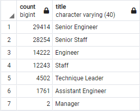
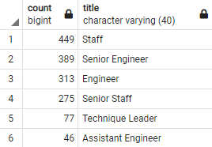

# Pewlett Hackard Analysis

## Resources 
PostgreSQL, pgAdmin, Quick DBD

Challenge code: [Employee_Database_challenge.sql](Queries/Employee_Database_challenge.sql)

Entity Relationship Diagram: [EmployeeDB.png](EmployeeDB.png)

Retirement Titles: [retirement_titles.csv](Data/retirement_titles.csv)

Unique Titles: [unique_titles.csv](Data/unique_titles.csv)

Retiring Titles: [retiring_titles.csv](Data/retiring_titles.csv)

Mentorship Eligibility: [mentorship_eligibility.csv](Data/mentorship_eligibility.csv)


## Overview 
To prepare for the "silver tsunami" at Pewlett Hackard, the following analysis was performed to determine the number of retiring employees per title and identify the employees eligible to participate in a mentorship program for this transition. 

## Results 

It is clear from the table below that the majority of those retiring are in senior positions, with senior engineers and senior staff being the top 2 title categories retiring. The total number of retiring staff who were born from 1952 to 1955 is 90,398. Of this retiree group, 32.5% are senior engineers, 31.3% are senior staff, 15.7% are engineers, 13.5% are staff, 5.0% are technique leaders, 2.0% are assistant engineers, and less than 0.0% are managers. 

With such a large number of employees retiring, and so little of them being managers, this could be a great opportunity for Pewlett Hackard to determine why some of the senior level employees were not given the opportunity to become a manager themselves. Or they can explore the other routes for why this was the case; for example, another explanation could be due to younger managers who are not retiring soon and therefore, were not captured in this analysis.

**Number of retiring staff by titles** 



There are a total of 1549 employees at Pewlett Hackard who are eligible to participate in the mentorship program. Next steps would be to determine how they enter the mentorship program. They could join based on their birthday, so this program will happen on a rolling basis, rather than all at once. Additionally, they can determine how many employees would be interested in this program and what they would like to receive from this program. 

## Summary

A total number of 90,398 roles will have to be filled as the silver tsunami begins to make an impact. This is a large number of roles to be filled in the upcoming years and the mentorship program will provide some assistance with this transition. A total of 1549 employees at Pewlett Hackard are eligible for mentorship. This number is approximately 1.7% of the total number of employees retiring. With such a small percentage available to mentor the next generation of workers, there are not enough qualified, retirement-ready employees. Additionally, it is interesting to note the titles for those eligible to become a mentor in the program as seen in the table below. There are twice the number of Senior Engineers retiring versus Engineers, but the number of employees eligible for mentorship are all relatively equal. Another important observation, there are twice the number of Senior Staff retiring verses Staff, but the opposite trend is observed for employees eligible for mentorship. There are twice the number of staff eligible for mentorship versus the senior staff. The difference for a senior role needs to be made clear to determine what additional information they can provide for this program. A lot of senior level staff retiring without passing on their knowledge and information can be detrimental to the company. 

**Additional queries made for this analysis:**
``` 
-- Count of employees retiring
SELECT COUNT (emp_no)
FROM unique_titles;

-- Count of employees eligible for mentorship
SELECT COUNT (emp_no)
FROM mentorship_eligibility;
```

**Mentorship Titles** [mentorship_titles.csv](Data/mentorship_titles.csv)



